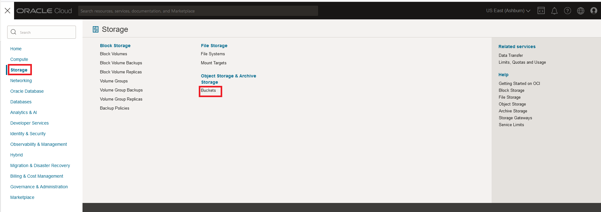

# Create and store data for Lakehouse

## Introduction

A set of files have been created for you to use in this workshop. You will use the files to create your own lakehouse cloud storage bucket.

### Objectives

- Create Object Storage bucket
- Download and unzip  Sample files
- Add files into  the new Bucket

### Prerequisites

- An Oracle Trial or Paid Cloud Account
- Some Experience with MySQL Shell
- Completed Lab 1

## Task 1: Create Object Storage bucket

1. From the Console navigation menu, click **Storage**.
2. Under Object Storage, click Buckets
    

    **NOTE:** Ensure the correct Compartment is selected : Select **heatwave**

3. Click Create Bucket. The Create Bucket pane is displayed.

    

4. Enter the Bucket Name **mysql-customer-orders**
5. Under Default Storage Tier, click Standard. Leave all the other fields at their default values.

    

6. The completed bucket creation should look like this:
    

## Task 2: Connect to  OCI Cloud Shell

The Cloud Shell machine is a small virtual machine running a Bash shell which you access through the Oracle Cloud Console (Homepage). You will start the Cloud Shell and generate a SSH Key to use  for the Bastion  session.

1. To start the Oracle Cloud shell, go to your Cloud console and click the cloud shell icon at the top right of the page. This will open the Cloud Shell in the browser, the first time it takes some time to generate it.

    

    

2. You can use the icons in the upper right corner of the Cloud Shell window to minimize, maximize, restart, and close your Cloud Shell session.

## Task 3: Download and unzip the database data files

1. Once the cloud shell has started, you can begin setting up the data for your new bucket.

2. Setup folder to house imported DB data

    a. Create folder

    ```bash
    <copy>mkdir db-data</copy>
     ```

    b. Go into folder

    ```bash
    <copy>cd db-data</copy>
     ```

3. Download the DB data zip file

    ```bash
    <copy>wget https://objectstorage.us-ashburn-1.oraclecloud.com/p/2ExgMxl79cjNUrcwh2EpQyiHayBq46hplIM8BI1V7lLRaIm6T63NORrqhQ4e0t4a/n/mysqlpm/b/mysql_customer_orders/o/mco_dump_02102023.zip</copy>
     ```

4. Unzip mco\_dump\_02102023.zip file which will generate folder datafiles with Approximate 440 files

    ```bash
    <copy>unzip mco\_dump\_02102023.zip</copy>
     ```

5. List the db-data folder to make the  mco\_dump\_02102023 was created

    ```bash
    <copy>ls ~/db-data</copy>
    ```

    

## Task 4: Add files into the Bucket using OCI CLI Command

1. Go into the ~/db-data folder and list all of the files

    ```bash
    <copy>cd ~/db-data</copy>
    ```

    ```bash
    <copy>ls</copy>
    ```

2. Add the mysql\_customer\_orders folder to the mysql\_customer\_orders  storage bucket by modifying the following command

    ```bash
    <copy> oci os object bulk-upload -bn mysql_customer_orders --src-dir mco\_dump\_02102023</copy>
     ```

3. View the mysql\_customer\_orders storage bucket
    - a. Minimize the OCI Cloud Shell
    - b. Go to Menu => Storage  => Buckets
    - c. Click the **mysql\_customer\_orders** bucket
4. The page should look like this:

    

You may now **proceed to the next lab**

## Acknowledgements

- **Author** - Perside Foster, MySQL Solution Engineering

- **Contributors** - Abhinav Agarwal, Senior Principal Product Manager, Nick Mader, MySQL Global Channel Enablement & Strategy Manager
- **Last Updated By/Date** - Perside Foster, MySQL Solution Engineering, May 2023
